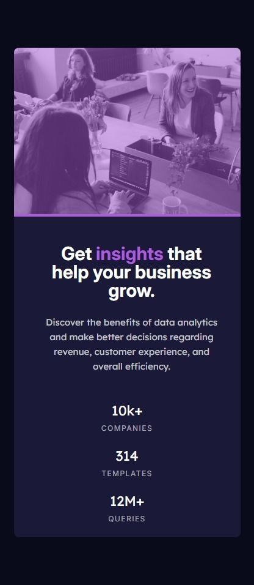

# Frontend Mentor - Stats preview card component solution

This is a solution to the [Stats preview card component challenge on Frontend Mentor](https://www.frontendmentor.io/challenges/stats-preview-card-component-8JqbgoU62). Frontend Mentor challenges help you improve your coding skills by building realistic projects.

## Table of contents

- [Overview](#overview)
  - [The challenge](#the-challenge)
  - [Screenshot](#screenshot)
  - [Links](#links)
- [My process](#my-process)
  - [Built with](#built-with)
  - [What I learned](#what-i-learned)
  - [Continued development](#continued-development)
  - [Useful resources](#useful-resources)
- [Author](#author)
- [Acknowledgments](#acknowledgments)

## Overview

### The challenge

Users should be able to:

- View the optimal layout depending on their device's screen size

### Screenshot




### Links

- Solution URL: [Solution on GitHub](https://github.com/horoserp/stats-preview)
- Live Site URL: [Live Site](https://horoserp.github.io/stats-preview)

## My process

### Built with

- Semantic HTML5 markup
- CSS (Flexbox)

### What I learned

I was excited to be able to incorporate the picture tag implemented in HTML5 to control which image is used based on the screen size. Equally thrilling, was the use of the column-reverse value for the flex-direction CSS property, as it is a value that is rarely used.

```html
<picture>
  <source
    media="(max-width: 767px)"
    srcset="./assets/images/image-header-mobile.jpg"
  />
  
</picture>
```

```css
section {
  flex-direction: column-reverse;
}
```

### Continued development

I would like to work on responsive mobile design while continuing to reinforce my HTML, CSS and JS skills.

### Useful resources

- [W3Schools](https://www.w3schools.com/) - This is a great reference site which helped me remember some of the required syntax.
- [Stack Overflow](https://stackoverflow.com/) - This is an excellent resource for finding answers to precise questions.

## Author

- Website - [Robert P. Horosewski](https://horoserp.github.io/React-Portfolio)
- Frontend Mentor - [@horoserp](https://www.frontendmentor.io/profile/horoserp)
- LinkedIn - [Robert P. Horosewski](https://www.linkedin.com/in/robert-horosewski-8a0608196/)

## Acknowledgments

Thanks to my wife for the encouragement to pursue my dream.
